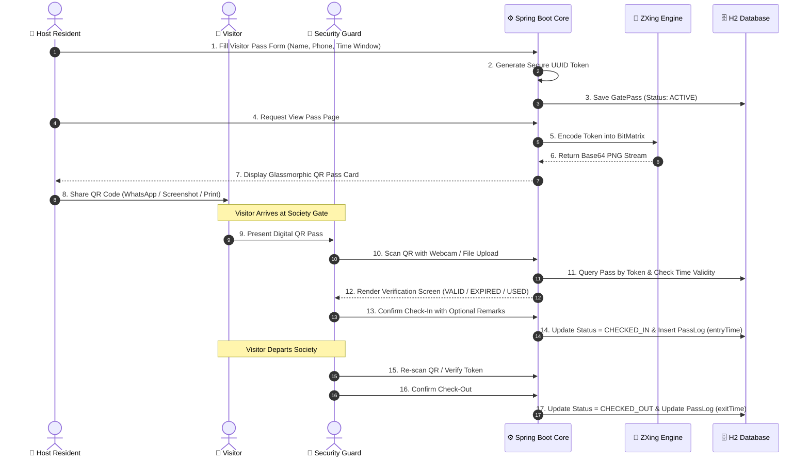
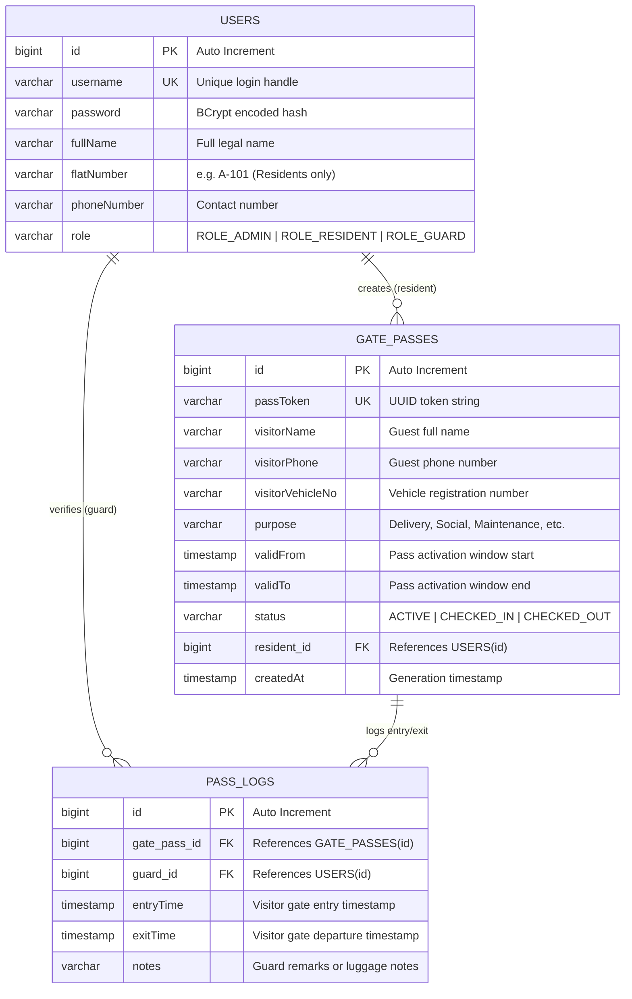

# 🛡️ AuthGate - QR Code Based Gate Pass System for Residential Society

<div align="center">


<br/>

**A Next-Generation, Secure, and Automated Visitor Access Management Portal for Gated Communities & Housing Societies.**

[Key Features](#-key-features) • [System Architecture](#-system-architecture--workflow) • [Tech Stack](#%EF%B8%8F-technology-stack) • [Installation Guide](#-installation--getting-started) • [API Reference](#-api--controller-endpoints) • [Team Members](#-team-members--contributors)

</div>

---

## 👥 Team Members & Project Contributors

This project was collaboratively designed, architected, and developed as a team academic & software engineering project by:

<div align="center">

| Name | Role / Contributions |
| :--- | :--- |
| 🧑‍💻 **Tirth Shah** | **Full-Stack Development & System Architecture**<br>• Core Spring Boot Backend & Security Architecture<br>• Business Logic, QR Code Generation Engine & Controller Flows<br>• Database Schema Design, H2 JPA Repositories & Execution Scripting |
| 👩‍💻 **Pratishtha Virpura** | **Backend Engineering & Access Control Security**<br>• Spring Security Configuration & Role-Based Authorization<br>• Gate Pass Verification State Machine & Check-In/Check-Out Service<br>• Admin Resident Management & Audit Logging Subsystems |
| 👩‍💻 **Saniya Ghanchi** | **Frontend Architecture & UX/UI Design**<br>• Responsive Glassmorphism Design System & CSS Theming<br>• HTML5 Live Webcam & File QR Code Scanner Integration<br>• Thymeleaf Template Architecture (Admin, Guard, and Resident Portals) |

</div>

---

## 📖 Project Overview & Problem Statement

### 🚫 The Traditional Problem
Conventional residential societies rely on manual paper logbooks at security gates. This approach suffers from critical vulnerabilities:
- **Zero Identity Verification**: Visitors can enter fake names, invalid phone numbers, and fabricated vehicle numbers.
- **Security Vulnerabilities**: No audit trail, no verification with the flat resident, and easy pass forgery.
- **Traffic Bottlenecks**: Manual entries create long vehicle queues at entry gates.
- **Privacy Breaches**: Any visitor can browse through previous visitors' private details in open physical registers.

### 💡 The AuthGate Solution
**AuthGate** modernizes residential security by replacing paper registers with **time-bound, digitally encrypted QR code gate passes**. 
- Residents pre-authorize their visitors by creating digital passes from their personal dashboard.
- A cryptographic Base64 QR code pass is generated and shared with the guest via WhatsApp/SMS/Email.
- When the visitor arrives at the security gate, the guard scans the QR code using a built-in webcam or smartphone scanner.
- The system instantaneously validates token authenticity, expiration timestamp, and state, logging exact entry and exit times automatically.

---

## ✨ Key Features

### 🏢 1. Multi-Role Authorization & Security
- **Role-Based Access Control (RBAC)** powered by **Spring Security** with 3 isolated roles:
  - **Resident (`ROLE_RESIDENT`)**: Issue visitor passes, view pass history, download QR passes.
  - **Security Guard (`ROLE_GUARD`)**: Live webcam scanner, file QR reader, manual token lookup, 1-click Check-In and Check-Out.
  - **Society Administrator (`ROLE_ADMIN`)**: High-level KPI dashboard, resident account management (CRUD), global society entry/exit audit logs.
- BCrypt encrypted passwords and session-based authentication protection.

### 📱 2. Dynamic QR Code Generation (ZXing Engine)
- Generates 250x250 high-contrast QR codes directly in memory using **Google ZXing**.
- Uses secure **UUID tokens** (`passToken`) instead of plain database IDs to prevent token enumeration and tampering.
- Encodes QR codes into **Base64 data URIs** (`data:image/png;base64,...`) for seamless client-side rendering with zero server storage overhead.

### 📷 3. Built-In Live Webcam & File Scanner
- **Zero Hardware Requirement**: Security guards do not need expensive proprietary barcode guns.
- Integrates the **HTML5-QRCode** JavaScript library directly into the Guard Dashboard.
- Supports both **Live Real-Time Camera Scanning** (front/back camera) and **Image File Upload Scanning**.
- Automatic audio-visual feedback on successful detection with instant token redirection.

### ⏱️ 4. State-Machine Pass Validation
Passes are governed by an automated status and time-window engine:
- `ACTIVE`: Pass created and within validity window (`validFrom` to `validTo`).
- `CHECKED_IN`: Visitor currently inside the premises.
- `CHECKED_OUT`: Visitor has exited the society.
- `EXPIRED`: System flags passes whose expiration timestamp has passed.

### 🎨 5. Glassmorphism UI & Modern Responsive Design
- Crafted with custom **Vanilla CSS3** utilizing backdrop filters, sleek gradient borders, soft glows, and dark-mode aesthetics.
- High performance with zero heavy frontend framework bloat.
- Fully responsive across desktop browsers, tablets, and mobile devices.

---

## 🏛️ System Architecture & Workflow

### 🔄 End-to-End Visitor Lifecycle Flow



---

## 📂 Project Directory Structure

```text
QR code based gate pass system for residential society/
│
├── .mvn/                                # Maven Wrapper binary dependencies
├── src/
│   ├── main/
│   │   ├── java/com/society/gatepass/
│   │   │   ├── controller/
│   │   │   │   ├── AdminController.java     # Admin stats, resident CRUD, and society logs
│   │   │   │   ├── AuthController.java      # Login mapping and dynamic role-based redirection
│   │   │   │   ├── GuardController.java     # Live scanner, verification, and check-in/out logic
│   │   │   │   └── ResidentController.java  # Pass creation, personal pass ledger, and QR viewer
│   │   │   │
│   │   │   ├── model/
│   │   │   │   ├── User.java                # User entity (Resident, Guard, Admin)
│   │   │   │   ├── GatePass.java            # Visitor pass entity with UUID token & validity
│   │   │   │   └── PassLog.java             # Entry/Exit audit logs linked to GatePass & Guard
│   │   │   │
│   │   │   ├── repository/
│   │   │   │   ├── UserRepository.java      # Spring Data JPA repository for Users
│   │   │   │   ├── GatePassRepository.java  # Spring Data JPA repository for GatePasses
│   │   │   │   └── PassLogRepository.java   # Spring Data JPA repository for PassLogs
│   │   │   │
│   │   │   ├── security/
│   │   │   │   └── SecurityConfig.java      # Spring Security configuration, BCrypt & FilterChains
│   │   │   │
│   │   │   ├── service/
│   │   │   │   ├── UserService.java         # User registration & BCrypt password hashing
│   │   │   │   ├── GatePassService.java     # Pass lifecycle state-machine & audit operations
│   │   │   │   └── QRCodeService.java       # ZXing Base64 QR code generation service
│   │   │   │
│   │   │   ├── DataInitializer.java         # Seeds initial demo accounts and sample passes
│   │   │   └── GatepassApplication.java     # Main Spring Boot application entry point
│   │   │
│   │   └── resources/
│   │       ├── static/
│   │       │   └── css/
│   │       │       └── styles.css           # Global custom glassmorphism design system
│   │       │
│   │       ├── templates/
│   │       │   ├── admin/
│   │       │   │   ├── dashboard.html       # Society KPI metrics & real-time activity feed
│   │       │   │   ├── residents.html       # Resident management & new account registration
│   │       │   │   └── logs.html            # Society-wide visitor log ledger
│   │       │   │
│   │       │   ├── guard/
│   │       │   │   ├── dashboard.html       # Guard command center with live webcam scanner
│   │       │   │   └── verify.html          # Pass status verification & check-in/out forms
│   │       │   │
│   │       │   ├── resident/
│   │       │   │   ├── dashboard.html       # Resident pass ledger & active visitor tracking
│   │       │   │   ├── create-pass.html     # New visitor pass generation form
│   │       │   │   └── view-pass.html       # High-resolution scannable QR pass card
│   │       │   │
│   │       │   └── login.html               # Central authentication portal
│   │       │
│   │       └── application.properties       # H2 DB config, JPA Hibernate, port & logging
│   │
│   └── test/
│       └── java/com/society/gatepass/
│           └── GatepassApplicationTests.java    # Spring Boot application context tests
│
├── .gitattributes                           # Git line ending configuration
├── .gitignore                               # Git ignored files (target/, .mv.db, IDE files)
├── mvnw                                     # Maven Wrapper shell script (Linux/macOS)
├── mvnw.cmd                                 # Maven Wrapper batch script (Windows)
├── pom.xml                                  # Maven dependencies & build configuration
├── README.md                                # Comprehensive Project Documentation
└── run.bat                                  # Quiet-mode fast launcher script for Windows
```

---

## 🛠️ Technology Stack

| Layer | Technology | Version | Purpose / Highlights |
| :--- | :--- | :--- | :--- |
| **Language** | Java (OpenJDK) | `21 (LTS)` | Modern Java features (Records, Pattern Matching, Enhanced Switch). |
| **Backend Framework** | Spring Boot | `4.1.0` | Inversion of Control, Dependency Injection & Embedded Web Server. |
| **Security Layer** | Spring Security | `6.x` | Role-based authorization, BCrypt password encoder, Session management. |
| **ORM / Persistence** | Spring Data JPA / Hibernate | `Hibernate 7.x` | Object-Relational Mapping, automated DDL generation & transactions. |
| **Database** | H2 Database Engine | `2.4.240` | File-persistent SQL database (`./gatepassdb.mv.db`) with web console. |
| **Template Engine** | Thymeleaf | `3.1+` | Server-side template rendering with `thymeleaf-extras-springsecurity6`. |
| **QR Code Engine** | Google ZXing | `3.5.3` | Matrix-to-image encoding directly into Base64 PNG data streams. |
| **Client-Side Scanner** | HTML5-QRCode | `2.3.8` | In-browser camera barcode reader with fallback image upload decoding. |
| **Styling & Theme** | Modern CSS3 | Custom | Clean Glassmorphic dark aesthetic, zero external CSS framework latency. |
| **Build & Tooling** | Apache Maven | Wrapper 3.9+ | Build automation, dependency management, reproducible packaging. |

---

## 🗄️ Database Design & Entity Relationship



---

## 🔐 Security & Access Control Matrix

The application implements strict path-level authorization. Requests to protected resources are intercepted and validated against user authorities:

| Request Pattern | Required Role | Auth Required? | Purpose & Target View |
| :--- | :--- | :---: | :--- |
| `/login` | Public | ❌ | Renders central login screen. |
| `/css/**`, `/js/**` | Public | ❌ | Static assets bypass security filter chains. |
| `/h2-console/**` | Public (Dev mode) | ❌ | Embedded H2 database management console. |
| `/` | Any Authenticated | ✅ | Dynamic landing router based on user role. |
| `/admin/**` | `ROLE_ADMIN` | ✅ | Admin dashboard, resident CRUD & society logs. |
| `/resident/**` | `ROLE_RESIDENT` | ✅ | Resident pass creation, pass ledger & QR viewer. |
| `/guard/**` | `ROLE_GUARD` | ✅ | Guard scanner dashboard, verify & check-in/out. |

---

## 🔗 API & Controller Endpoints

### 1. Authentication Controller (`/`)
- `GET /login` — Renders central login form.
- `GET /` — Authenticated router:
  - `ROLE_ADMIN` &rarr; `/admin/dashboard`
  - `ROLE_GUARD` &rarr; `/guard/dashboard`
  - `ROLE_RESIDENT` &rarr; `/resident/dashboard`

### 2. Resident Controller (`/resident`)
- `GET /resident/dashboard` — View all passes created by the logged-in resident.
- `GET /resident/create-pass` — Render visitor pass creation form (pre-filled with 4-hour window).
- `POST /resident/create-pass` — Save pass, generate UUID token, and redirect to QR card.
- `GET /resident/view-pass/{token}` — Generate and display Base64 QR pass card for printing/sharing.

### 3. Guard Controller (`/guard`)
- `GET /guard/dashboard` — Live camera scanner, file uploader, and today's check-in/out feed.
- `GET /guard/verify?token={token}` — Verify pass validity, expiration status, and guest details.
- `POST /guard/check-in` — Set status to `CHECKED_IN`, log entry timestamp and guard remarks.
- `POST /guard/check-out` — Set status to `CHECKED_OUT`, log exit timestamp.

### 4. Admin Controller (`/admin`)
- `GET /admin/dashboard` — Society statistics (Total Residents, Active Passes, Visitors Inside, Recent Logs).
- `GET /admin/residents` — Manage society residents with integrated creation modal.
- `POST /admin/residents` — Register new resident account (BCrypt encoded).
- `GET /admin/residents/delete/{id}` — Delete resident account.
- `GET /admin/logs` — Complete society entry and exit audit history.

---

## 🚀 Installation & Getting Started

### Prerequisites
- **Java Development Kit (JDK)**: Version 21 or higher installed ([Download OpenJDK 21](https://adoptium.net/temurin/releases/?version=21)).
- **Git**: Installed and configured on your machine.
- Web browser with camera permissions enabled (for live QR scanner testing).

---

### Method 1: Quick Launch on Windows (Recommended)

1. Open your terminal (Command Prompt or PowerShell) inside the project folder:
   ```cmd
   cd "d:\All Project\QR code based gate pass system for residential society"
   ```
2. Run the provided quick-start batch script:
   ```cmd
   .\run.bat
   ```
   *This script runs Maven in quiet mode (`-q`), sets up the database, and prints connection links.*
3. Open your browser and navigate to: **[http://localhost:8080](http://localhost:8080)**

---

### Method 2: Standard Command Line (Windows / Linux / macOS)

1. **Clone or Navigate to the Repository**:
   ```bash
   cd "QR code based gate pass system for residential society"
   ```
2. **Build and Run using Maven Wrapper**:
   - **On Windows**:
     ```cmd
     .\mvnw.cmd clean spring-boot:run
     ```
   - **On Linux / macOS**:
     ```bash
     chmod +x mvnw
     ./mvnw clean spring-boot:run
     ```
3. Open **[http://localhost:8080](http://localhost:8080)** in your browser.

---

### Method 3: Running via IDE (IntelliJ IDEA / Eclipse / VS Code)

1. **IntelliJ IDEA**:
   - Open IntelliJ &rarr; **File** &rarr; **Open...** &rarr; Select project root directory.
   - Wait for IntelliJ to sync dependencies from `pom.xml`.
   - Ensure Project SDK is set to **Java 21** (**File** &rarr; **Project Structure** &rarr; **Project**).
   - Locate `src/main/java/com/society/gatepass/GatepassApplication.java`.
   - Click the green **Run ▶** icon.
2. **VS Code**:
   - Open folder in VS Code with the *Extension Pack for Java* installed.
   - Run the `GatepassApplication.java` file.

---

## 🔑 Demo Login Credentials

The application automatically seeds the database on first boot with pre-configured accounts:

| Role | Username | Password | Purpose / Features to Test |
| :--- | :--- | :--- | :--- |
| 🛡️ **System Admin** | `admin` | `admin123` | View total KPIs, manage residents, audit all society entry logs. |
| 👮 **Security Guard** | `guard` | `guard123` | Live webcam scanner, file QR uploader, check-in & check-out validation. |
| 🏠 **Resident 1 (Flat A-101)** | `resident1` | `pass123` | Create passes for visitors, view pass history, download QR pass. |
| 🏠 **Resident 2 (Flat B-202)** | `resident2` | `pass123` | Create and manage passes for Flat B-202. |

### 🧪 Pre-Seeded Test QR Tokens
You can test the guard verification module immediately by entering these sample tokens manually:
- **`active-pass-token`** &rarr; Valid active pass (Visitor: *Alice Green*).
- **`expired-pass-token`** &rarr; Expired pass (Visitor: *Bob Brown*).

---

## 🗄️ H2 Database Console Access

To inspect the live SQL database tables in real time:
1. Navigate to: **[http://localhost:8080/h2-console](http://localhost:8080/h2-console)**
2. Enter the connection settings matching `application.properties`:
   - **JDBC URL**: `jdbc:h2:file:./gatepassdb`
   - **User Name**: `sa`
   - **Password**: *(Leave empty)*
3. Click **Connect** to query `USERS`, `GATE_PASSES`, and `PASS_LOGS` tables.

---

## 🧪 Testing the Complete Workflow

To experience the complete system flow:
1. **Login as Resident** (`resident1` / `pass123`).
2. Click **"+ Create New Pass"**, enter guest details (*e.g., John Doe, 9876543210, Purpose: Meeting*), and click **"Generate Gate Pass"**.
3. View the generated **QR Code Card** on screen. (You can download the QR or copy the token).
4. **Logout** and **Login as Guard** (`guard` / `guard123`).
5. Open the **Live Scanner** (point camera at the QR code) or enter the token into the manual input box and click **"Verify Pass"**.
6. Inspect the verification banner (**"VALID PASS"**). Click **"Approve Check-In"**.
7. Observe the status change to `CHECKED_IN` in both the Guard activity feed and Admin Dashboard.
8. When the visitor leaves, repeat the scan and click **"Approve Check-Out"** to close the pass lifecycle.

---

## 🔮 Future Roadmap & Enhancements

- [ ] **Instant WhatsApp & SMS Notifications**: Automatic WhatsApp alerts to residents upon visitor gate arrival.
- [ ] **Multi-Gate Synchronization**: Distributed guard terminal support across multiple entry/exit gates.
- [ ] **Frequent Visitor Pre-Approvals**: Long-term passes for maids, drivers, and daily maintenance staff.
- [ ] **Facial Recognition Integration**: AI-powered biometric verification for regular residents and verified staff.
- [ ] **Mobile Application**: Native Flutter / React Native mobile app for iOS and Android.

---

## 📄 License & Academic Note

This project is developed for educational, academic, and practical residential society access management purposes.

**AuthGate Project Team**:
- **Tirth Shah**
- **Pratishtha Virpura**
- **Saniya Ghanchi**

*All rights reserved © 2026.*
